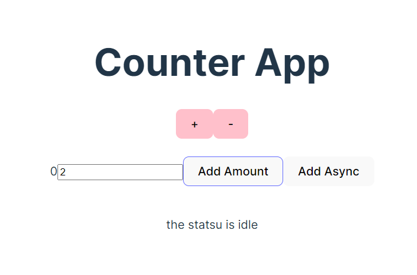

# RTK basic flow.
### basic funcionality of useSelector and useDispatch
### using createAsyncThunk - async dispatch
### extraReducers , builder:pending,rejected and fullfill
 createSlice take 3 things:
 * name
 * initialState, we have to pass initial state value
 * reducers - that tell what to do with all the actions
 
CreateAsyncThunk - let as handle async tasks  see lecture 42

extraReducer  - see lecture 42

